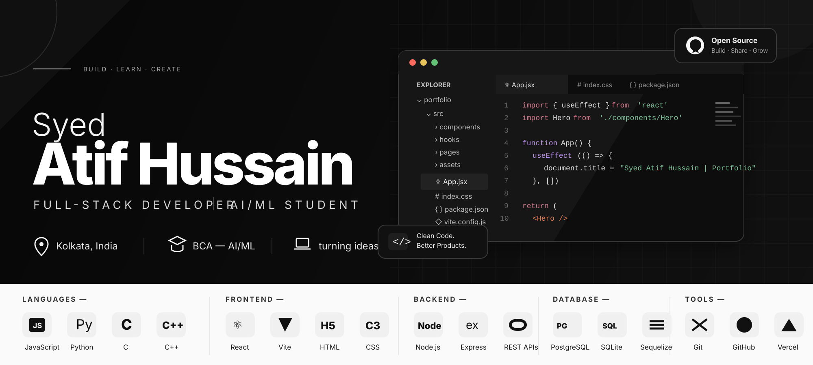

<div align="center">



<br/>

<a href="https://github.com/syedatifhussainfr">
  
</a>
<a href="https://instagram.com/atifrizz">
  
</a>
<a href="mailto:syed.atif.hussain4131@gmail.com">
  
</a>

<br/><br/>


</div>

---

## About me

```text
name       = Syed Atif Hussain
username   = syedatifhussainfr
alias      = v4t3rnom
focus      = Full-Stack Development + AI/ML
education  = BCA — AI/ML
location   = Kolkata, India
mindset    = Build → Break → Learn → Improve → Ship
```

I'm a BCA AI/ML student and developer who likes turning ideas into working software.

I'm currently building **AttendX**, a production-style attendance operations platform featuring database-backed class workspaces, secure authentication, recoverable attendance sessions, analytics, protected administration, and verified backup restoration.

My projects usually sit somewhere between **web development, backend systems, AI/ML, automation, developer tools, and student-focused software**. I enjoy building complete products instead of stopping at a UI mock-up.

---

## Tech stack

### Languages


### Backend & web


### Tools


---

## Selected projects

<div align="center">

### AttendX

**Secure, class-aware attendance operations for educational institutions**

A full-stack attendance platform built to replace slow roll calls with controlled, recoverable, and accountable academic workflows.

[](https://github.com/syedatifhussainfr/AttendX/releases/latest)
[](https://github.com/syedatifhussainfr/AttendX)
[](https://github.com/syedatifhussainfr/AttendX)

</div>

<table>
<tr>
<td width="33%" valign="top">

### Academic operations

- Database-backed class workspaces
- Class-scoped student rosters
- Subjects and timetables
- Faculty and mentor assignments
- Live attendance sessions
- Student and subject analytics

</td>
<td width="33%" valign="top">

### Reliability

- Recoverable attendance queue
- Verified SQLite backups
- Protected database restoration
- In-process database reconnection
- Human-readable Excel reports
- Permanent audit history

</td>
<td width="33%" valign="top">

### Security

- Rotating refresh sessions
- Role and permission hierarchy
- Admin++ protected operations
- Password-confirmed changes
- Rate-limited uploads
- Validated configuration policy

</td>
</tr>
</table>

**Stack:** React · Vite · Node.js · Express · Sequelize · SQLite · PostgreSQL

---

<table>
<tr>
<td width="50%" valign="top">

### QRVerse

A QR generation and scanning platform built around practical browser tooling and a clean web experience.

**What it includes**

- Multiple QR types
- QR generation and scanning
- File and image-based scanning
- Download and export workflow
- Browser-friendly implementation

**Stack:** Node.js · Express · JavaScript · HTML · CSS

<a href="https://github.com/syedatifhussainfr/qr-verse">
  
</a>

</td>
<td width="50%" valign="top">

### KalNest

An authentication-focused Node.js project exploring account flows, sessions, verification, password recovery, and modern sign-in systems.

**Focus**

- Authentication flows
- Session handling
- Google sign-in
- Email verification
- Account security

**Stack:** Node.js · JavaScript · APIs

<a href="https://github.com/syedatifhussainfr/KalNest">
  
</a>

</td>
</tr>
</table>

---

## What I'm working toward

```text
01  Build production-style full-stack applications
02  Go deeper into AI/ML instead of only using API wrappers
03  Improve backend architecture, security and testing
04  Build software that solves actual student problems
05  Get stronger at data structures, algorithms and systems
06  Ship cleaner open-source projects with better documentation
```

---

## Areas I enjoy

`Full-Stack Development` · `AI/ML` · `Automation` · `Backend Systems` · `Developer Tools` · `Web Security` · `Student Tech`

---

## GitHub

Instead of depending on third-party GitHub-stat cards that can be paused or rate-limited, this profile links directly to GitHub for the source of truth.

<p align="center">
  <a href="https://github.com/syedatifhussainfr?tab=repositories">
    
  </a>
  <a href="https://github.com/syedatifhussainfr?tab=stars">
    
  </a>
</p>

---

## Current philosophy

```js
const developer = {
  name: "Syed Atif Hussain",
  build: [
    "full-stack products",
    "secure backend systems",
    "AI/ML experiments",
    "automation",
    "developer tools"
  ],
  featuredProject: "AttendX",
  approach: "understand it, build it, break it, improve it, ship it",
  currently: "turning student problems into production-style software",
  next: "something harder than the last release"
};
```

---

## Connect

<p align="center">
  <a href="mailto:syed.atif.hussain4131@gmail.com">
    
  </a>
  <a href="https://github.com/syedatifhussainfr">
    
  </a>
  <a href="https://instagram.com/atifrizz">
    
  </a>
</p>

<div align="center">

**Build things you would actually want to use.**

<br/>


</div>
